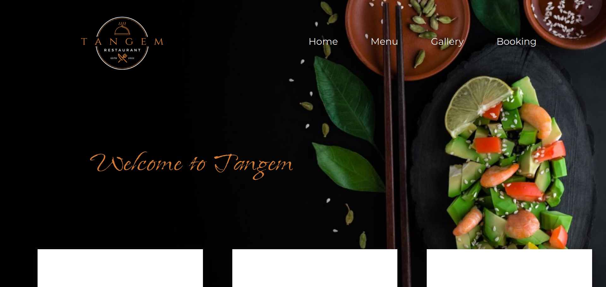

# Проект "Restaurant"



Этот проект был создан мной в качестве моего первого опыта в веб-разработке.

## Описание

Сайт "Restaurant" был создан командой из трех человек во время хакатона.

Проект "Restaurant" - это веб-сайт, представляющий виртуальный ресторан. В рамках создания этого проекта я использовал HTML, CSS и JavaScript. Сайт включает в себя различные разделы, включая информацию о ресторане, его меню, историю и команду.

## Особенности проекта

- Привлекательный и современный дизайн.
- Раздел "История", рассказывающий уникальную историю создания ресторана.
- Галерея изображений, чтобы передать атмосферу заведения.
- Информация о команде ресторана и их контактных данных.

## Технологии

Проект был разработан с использованием следующих технологий:

- **HTML**: Для разметки и структуры контента.
- **CSS**: Для стилизации и визуального оформления сайта.
- **JavaScript**: Для добавления интерактивных элементов.
- **AOS (Animate on Scroll)**: Для создания анимации при прокрутке страницы.

## Запуск проекта

Для того чтобы посмотреть проект, вы можете открыть файл `index.html` в вашем веб-браузере.

```bash
open index.html
